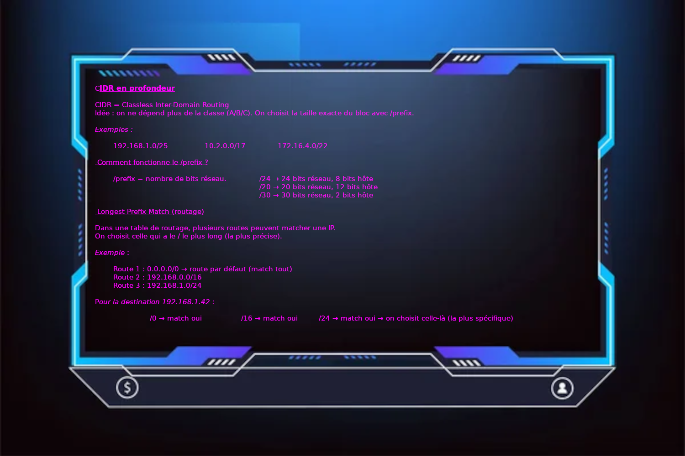

*This project has been created as part of the 42 curriculum by -nkiefer- .*

# 📡 NetPractice — Networking Training Project

<p align="center">
    
</p>


## 📝 Description

Avec NetPractice on apprend a manipuler des IP et a configurer un reseau 
justement.  
Il faut configurer les adresses IP, masques, passerelles et routes.
Faire attention au plage IP ainsi qu'a l'utilisation des bon masques.

---

## 🚀 Instructions

Tout sur les reseaux et internet edition DUNOD de J-Fr PILLOU et Fab LEMAINQUE

Internet Protocol Version 4 
{
a peu pret 4 milliard d'adresse (trop peu aujourdh hui)
Quand la penurie d 'adresse a commencer a se faire sentir on a alors suivie
Le NAP et le CIDR
Classless Inter-Domain Routing (plus en octet mais en bit)
impose un nombre stict d'oridnateur par reseau (A : 126 reseau possible pour 16 777 214 ordinateur maximun | B :16 384 reseaux possibles pour 65534 pc | C : 2097152 reseaux possibles pour seulement 254 pc disponibles)
Traduction d'adresse Reseau : pour le routeur, permet de connecter le reseau du routeur a internet sans avoir d'erreur IP
Modem : desormais directemtn dans les routeurs, permet la traduction analogiaue en numerique et vice versa.
8bit
}
Vs
Internet Protocol Version 6
{
7 x 10puissance 23 adresse IP par m2 (surface de la terre)
= possibilite infinie
en hexadecimal. 
16bit
}

### 🔧 Pré-requis
- Navigateur moderne capable d'executer l'html
- Extension Live-Server sur Vscode

### ▶️ Lancer l’interface d'entraînement
1. Cloner le dépôt :
   ```bash
   git clone git@github.com:KptaineN/Net_Pratique.git

