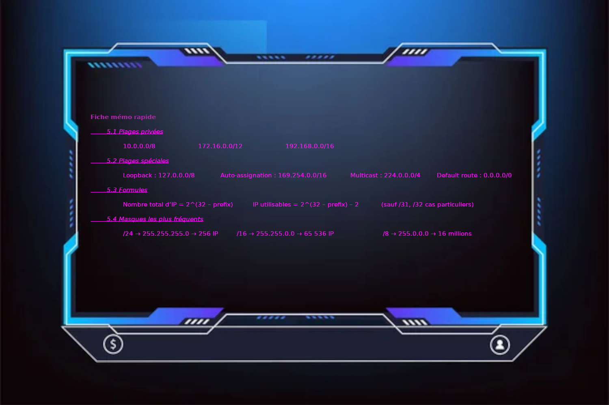
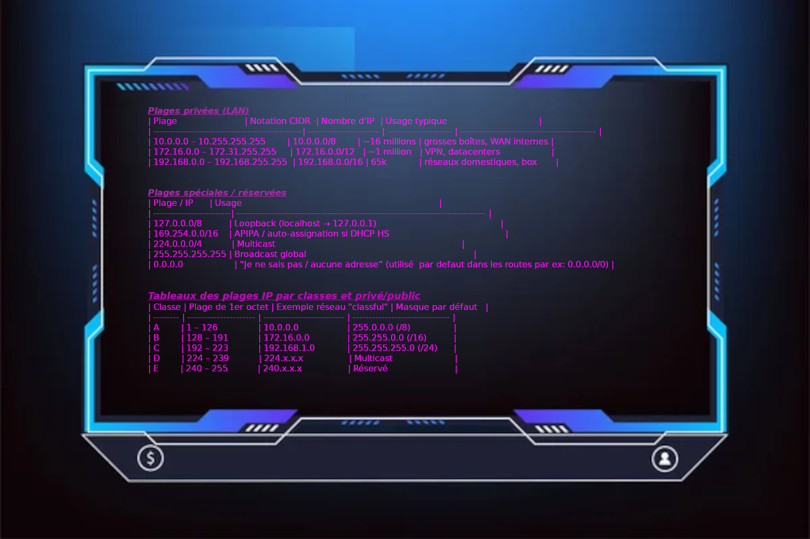
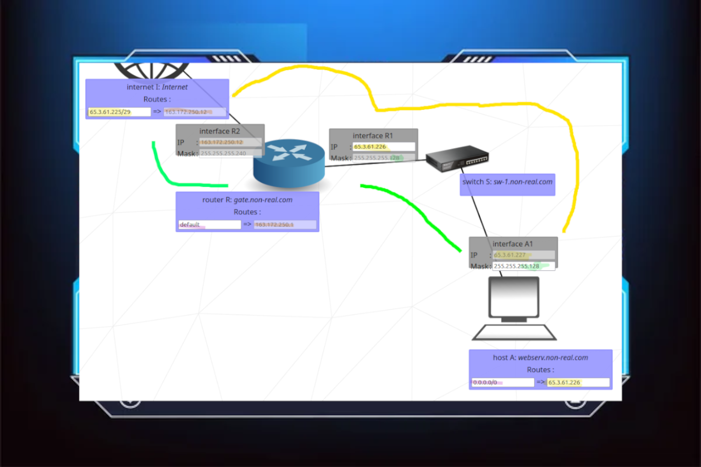
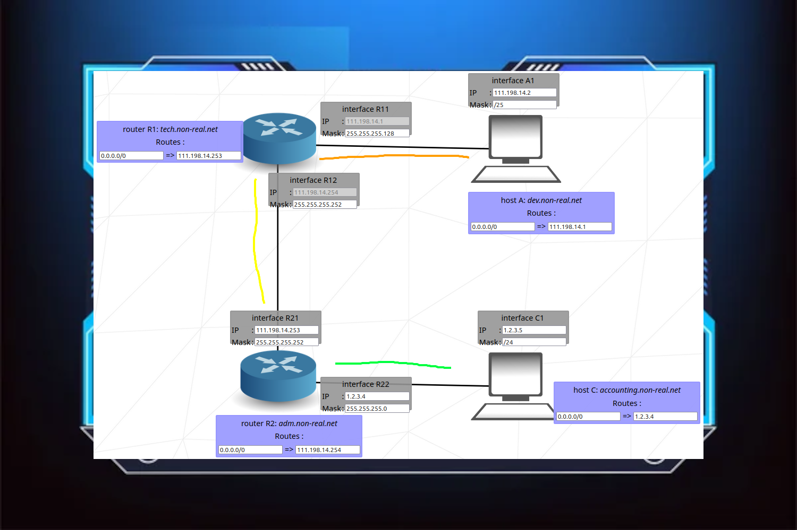
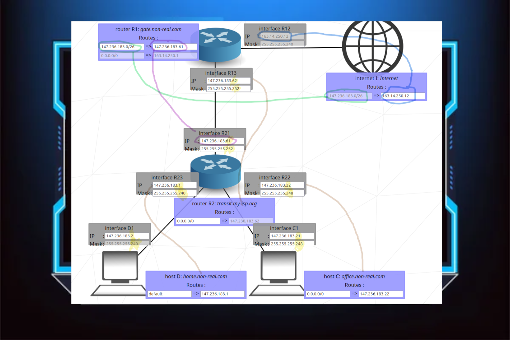
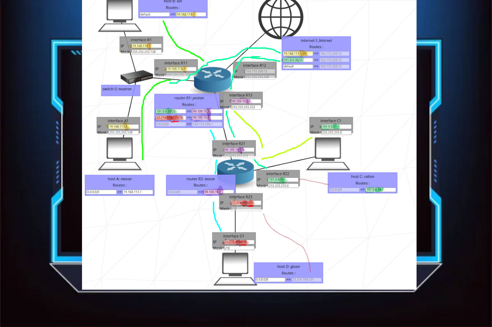
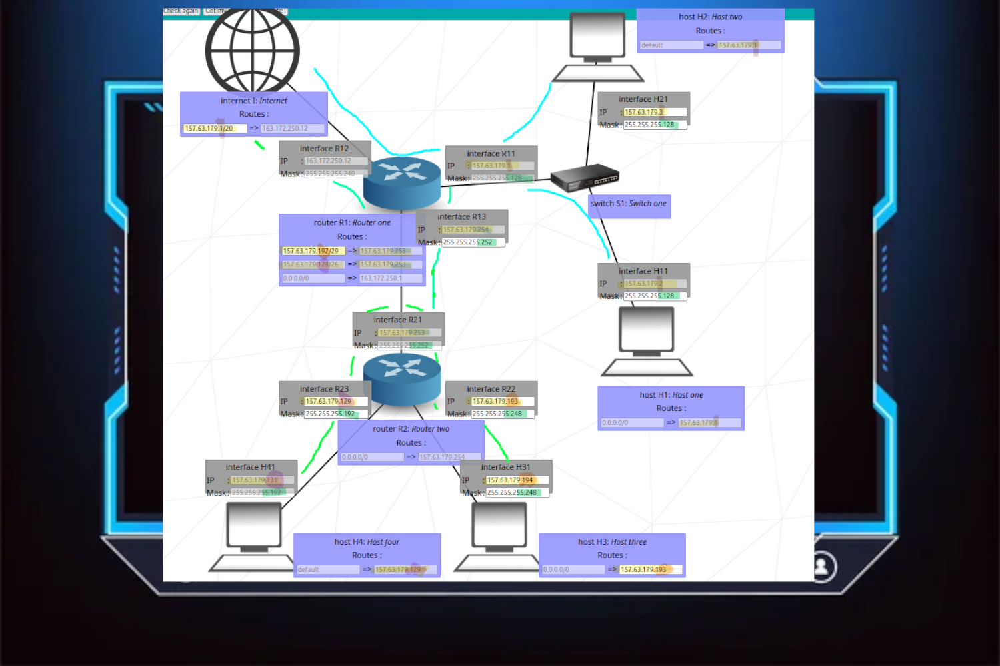

*This project has been created as part of the 42 curriculum by -nkiefer-.*

# 📡 NetPractice — Networking Training Project

    

---

## 📝 Description

NetPractice est un projet permettant de comprendre et manipuler les bases du réseau :  
configuration IP, masques, sous-réseaux, passerelles et tables de routage.  
Le but est de réussir à établir la communication entre différentes machines grâce à une configuration réseau cohérente.

---

## ⚡ Quick Rappel Général

| Concept | Rôle |
|---|---|
| **IP Address** | Identifie une machine sur un réseau |
| **Subnet Mask (CIDR)** | Définit la taille du réseau & plage IP |
| **Gateway** | Point de sortie vers un autre réseau |
| **Router** | Fait transiter les paquets entre réseaux |
| **Switch** | Relie plusieurs machines dans un même LAN |
| **Route** | Indique au système *par où envoyer le trafic* |
| **Network ID / Broadcast** | Première & dernière IP du réseau, non utilisables |

📌 Si deux hôtes sont sur **le même réseau → communication directe**  
📌 Sinon → **passage par la gateway & route adaptée**

---

## 📂 Pré-requis

- Navigateur moderne (Firefox/Chrome)
- (Optionnel) VSCode + extension **Live Server**

---

## 🌐 IP — Récap utile

### 📦 IPv4 vs IPv6

| Version | Taille | Format | Nb d’adresses | Notes |
|---|---|---|---|---|
| **IPv4** | 32 bits | Décimal (0–255) | ~4,3 milliards | limité → apparition CIDR/NAT |
| **IPv6** | 128 bits | Hexadécimal | 3,4×10³⁸ (~infini) | solution à la pénurie IPv4 |

---

### 🔢 Valeur binaire d’un octet

| Binaire | Décimal |
|---|---|
| 00000000 | 0 |
| 10000000 | 128 |
| 11000000 | 192 |
| 11100000 | 224 |
| 11110000 | 240 |
| 11111000 | 248 |
| 11111100 | 252 |
| 11111110 | 254 |
| 11111111 | 255 |

---

### 📊 Tableau CIDR & Masques

| CIDR | Subnet Mask | Wildcard Mask | Nb IP total | IP utilisables |
|---|---|---|---|---|
| /32 | 255.255.255.255 | 0.0.0.0 | 1 | 1 |
| /31 | 255.255.255.254 | 0.0.0.1 | 2 | 2 |
| /30 | 255.255.255.252 | 0.0.0.3 | 4 | 2 |
| /29 | 255.255.255.248 | 0.0.0.7 | 8 | 6 |
| /28 | 255.255.255.240 | 0.0.0.15 | 16 | 14 |
| ... | ... | ... | ... | ... |
| /1 | 128.0.0.0 | 127.255.255.255 | 2 147 483 648 | 2 147 483 646 |
| /0 | 0.0.0.0 | 255.255.255.255 | 4 294 967 296 | 4 294 967 294 |

> 🔎 `/24` = 256 IP → 254 utilisables (0 = réseau, 255 = broadcast)

---

## 📸 Mémo/Diapos (Affichage interactif)

### CIDR Memo  

🔽 Voir l'image

### Specificity  

🔽 Voir l'image

### Plage  

🔽 Voir l'image

---

## 🧠 Résolutions Niveau → Réponses visuelles

| Level | Aperçu |
|----|---|
| 6  | 

Clique pour voir

 |
| 7  | 

Clique pour voir

 |
| 8  | 

Clique pour voir

 |
| 9  | 

Clique pour voir

 |
| 10 | 

Clique pour voir

 |

---

